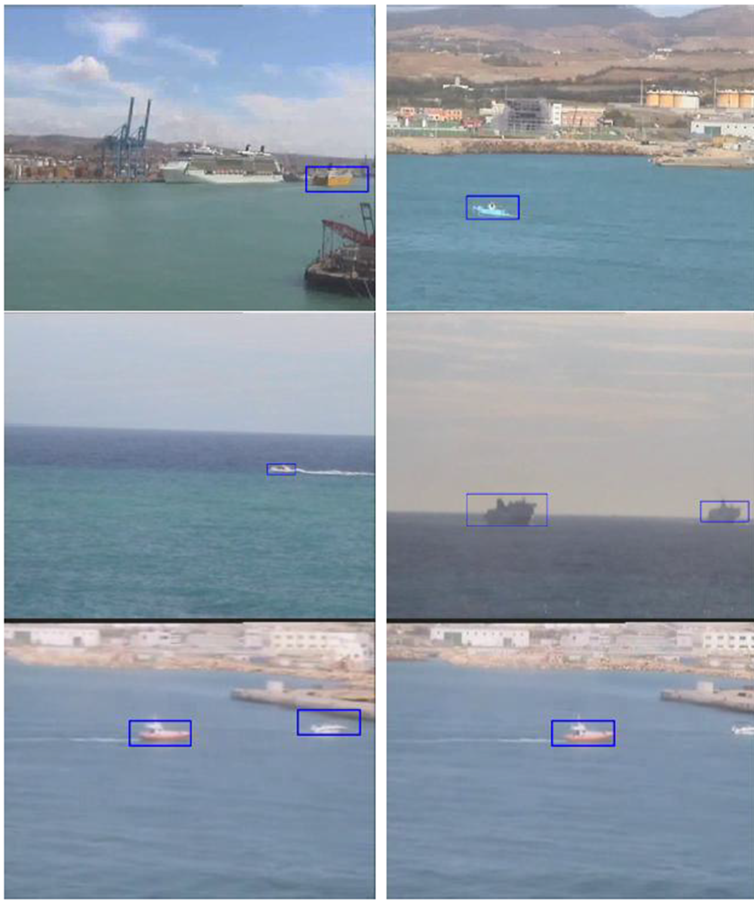

# fast_vessel_detection

To achieve the goal of developing (semi-)autonomous boats, reliable vision-based methods for vessel detection, classification, and tracking are needed. This repository contains the code of a machine learning approach for vessels detection from a moving and zooming camera. In particular, the proposed method is supervised and derives from a fast and robust people detection algorithm [Dollar et al., 2014]. Ground-truth annotations are also contained in this repository.

Boat detection using the proposed method on different videos from the MarDCT data base. The algorithm runs at multiple scales and can detect vessels of different size with varying lighting conditions.

## References

Dollar, P. Appel, R. Belongie, S. & Perona, P. 2014. Fast feature pyramids for object detection, IEEE Trans. Pattern Anal. Mach. Intell. 36: 1532–1545.
